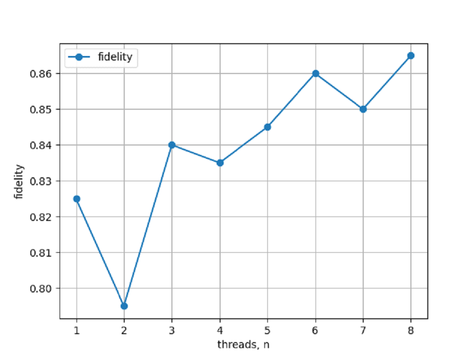

# mp_neuralnet_digits
Нейросеть для распознавания цифр от 0 до 9 с обучением типа Backprop

Реализована многопоточность обучения, с целью выявления зависимости точности обучения от количества поток за определенный промежуток операций.

